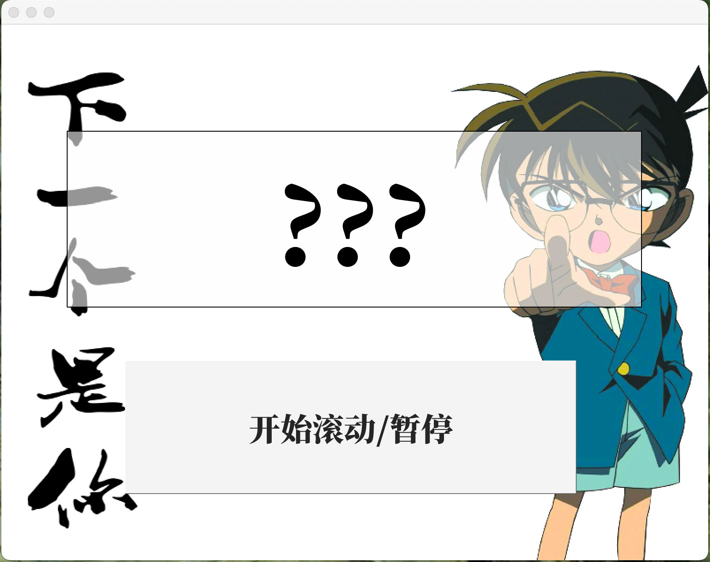

# 随机数点名器(NoHand)
<a id='jump1'>中文</a>|<a id='jump2'>English</a>

<span id="jump1"> </span>

>**你不想小组任务总变成组长任务;  
你不想班级活动总变成班委活动,最终又变成班长活动…  
你不甘、你委屈、你忍气吞声  
你的同学摆烂划水,你总是任劳任怨;  
你的组员互相推诿,你总是一个人承担所有……**    

>**你可以改变!**  

>**python开发随机数点名器  
滚动名单,公平抽选  
一键导入人选池  
多种选项,持续更新  
你只需要给出名单,剩下的交给我!**  

## 运行环境
- python3
- PyQt5
## 快速上手
不想看代码?不想配置python环境
你可以选择下载exe执行文件(Nohand/release/window/)直接运行!

## 运行前
配置目标名单  
- totalList.txt中名单，即滚动阶段显示的人员名单
- luckyList.txt中名单，即最终抽取的人员名单

## 运行程序  
- 长按**开始滚动/暂停**开始抽取
- 松开鼠标停止滚动，确定抽取对象

## 更换背景图
- 选取你想要的图片重命名为background.png  
- 移入NoHand.exe同一文件夹覆盖原background.png文件
- 重新启动

## 配置参数

```json
用记事本打开json文件
./settings.json  
{
"order":1,
"delay":0.05,
}
```
- order=1   
按照luckyList顺序循环抽取一人  
order=0  
在luckyList中随机抽取
- delay  
每一个名字停留时间（默认0.05s)  
**注意：delay小于0.02s会产生某些不可知的错误**

## 屏幕快照



## 计划
- [新模式] 批量随机数
- [新选项] 不同的滚动动画
- 网页版NoHand

##### 定制随机数或有其他问题<br>请联系作者1062934106@qq.com

<br>
<br>
<br>
<br>
<span id="jump2"> </span>

# NoHand

a python-based tool to help you allocate tasks.

## Requirements :
- python3
- PyQt5
## Quick Start

If you are sick of coding, I has bundled the application and all its dependencies into package with **Pyinstaller**.

**You don't need to configure Python runtime environment!**

Please download NoHand.zip according to your OS(At present,pack is only available for Window User).

- ./release/Window/NoHand.zip

## Before Runing

Edit list of names():

>- Names in totalList.txt will appear in rolling section.
>- Names in luckyList.txt will appear in result section(that is to say, lucky dog would be selected from this list).

In most time, two lists should be same.	 [doge]

## Running NoHand

- Long press button**"开始滚动/暂停"** to begin rolling.Names in **totalList.txt** will rolling on the screen.

- Release your mouse to stop rolling.A name in **luckyList.txt** will stay on the screen.

## Background

- Rename your background picture with ''background.png''.
- Overwrite origin file(background.png in the same directory of NoHand.exe or NoHand.py) with your favorite one.
- Reboot NoHand

## Options

```json
open json with notepad.exe
./settings.json  
{
"order":1,
"delay":0.05,
}
```
- order=0  
Results will be selected randomly from luckyList.<br>
order=1   
Names will show successively in the order of luckyList(in a circle).

>If times of your pressing is out of luckyList,the result will begin from the first name in LuckyList.


- delay  
    Occurrence time of each name(default 0.05s).
>**Warnning**:Never cut delay time shorter than 0.02s!
>
>If refreshing freuence is too high, names in totalList may stay in the result window(which may be different from those you want).

## Snapshot


## TO DO
- [New Mode] generate a list of lucky dogs with at one time.
- [New Option] different rolling flash.
- NoHand for Web

#### contact me at 1062934106@qq.com if you have trouble or ideas.